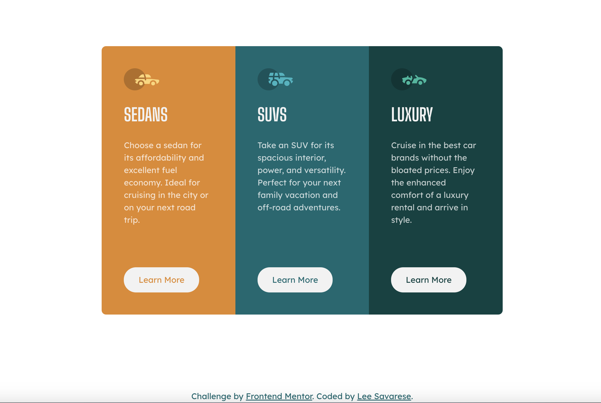

# Frontend Mentor - 3-column preview card component solution

This is a solution to the [3-column preview card component challenge on Frontend Mentor](https://www.frontendmentor.io/challenges/3column-preview-card-component-pH92eAR2-). Frontend Mentor challenges help you improve your coding skills by building realistic projects. 

## Table of contents

- [Overview](#overview)
  - [The challenge](#the-challenge)
  - [Screenshot](#screenshot)
  - [Links](#links)
- [My process](#my-process)
  - [Built with](#built-with)
  - [What I learned](#what-i-learned)
  - [Continued development](#continued-development)
  - [Useful resources](#useful-resources)
- [Author](#author)
- [Acknowledgments](#acknowledgments)

## Overview

### The challenge

Users should be able to:

- View the optimal layout depending on their device's screen size
- See hover states for interactive elements

### Screenshot

### Links

- Solution URL: [https://github.com/leesav3/product-preview-card-component-main](https://github.com/leesav3/product-preview-card-component-main)
- Live Site URL: [https://leesav3.github.io/3-column-preview-card-component-main/](https://leesav3.github.io/3-column-preview-card-component-main/)

## My process

### Built with

- Semantic HTML5 markup
- CSS custom properties
- CSS Grid
- Mobile-first workflow

### What I learned

- Learned about subgrid even though it's not available yet. 
- Learned how to center a grid container!
- Learned how to keep the buttons aligned and not float up. <-- that was a struggle!

### Continued development

- I want to focus on getting more comfortable with CSS Grid

### Useful resources

- too many to list!

## Author

- Frontend Mentor - [@leesav3](https://www.frontendmentor.io/profile/leesav3)

## Acknowledgments

Thanks to GDI Front End Cohort for this challenge. :)
